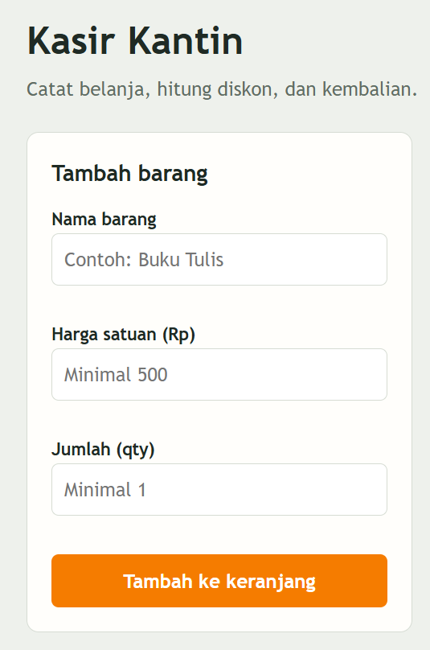
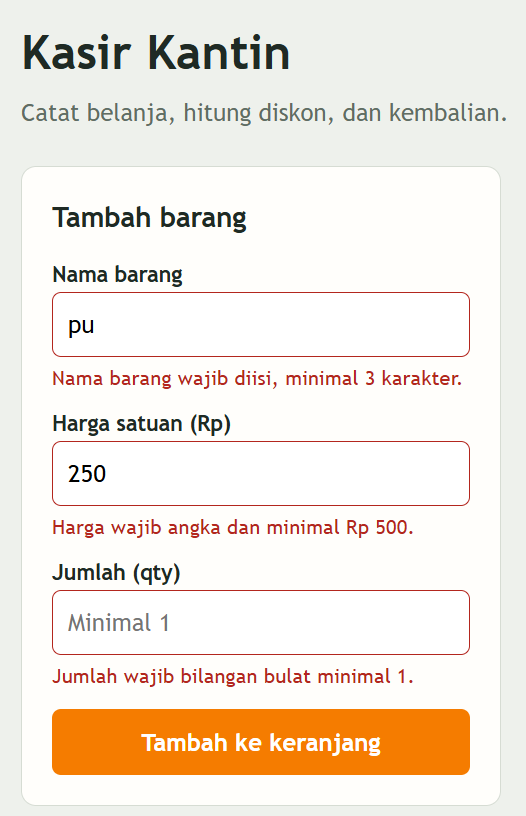
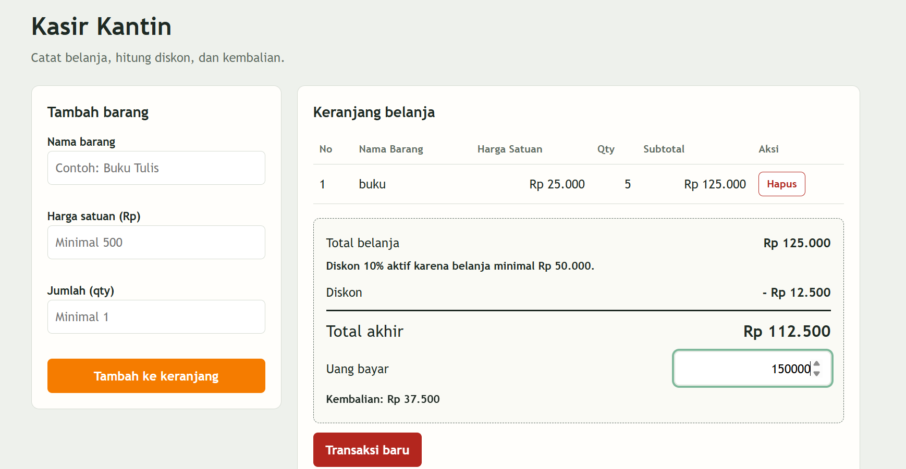

# Mini POS – Kasir & Keranjang Belanja Kantin Kampus

Nama: Mega Zayyani

NIM: 123140180

Kelas Praktikum: RB

## Deskripsi Aplikasi
Aplikasi web kasir sederhana untuk kantin kampus. Kasir memasukkan barang, aplikasi menghitung subtotal, total, diskon, dan kembalian secara otomatis. Keranjang disimpan di localStorage sehingga tidak hilang saat halaman di-refresh.

## Panduan Menjalankan
1. Buka folder proyek di VS Code.
2. Install ekstensi Live Server.
3. Klik kanan index.html → Open with Live Server (atau buka langsung file index.html di browser).

## Daftar Fitur
| Checkbox | Fitur |
|---|---|
| [V] | Validasi nama barang (wajib, minimal 3 karakter) |
| [V] | Validasi harga satuan (angka, minimal Rp 500) |
| [V] | Validasi qty (bilangan bulat, minimal 1) |
| [V] | Pesan error merah di bawah input; barang tidak masuk jika tidak valid |
| [V] | Form otomatis reset setelah berhasil |
| [V] | Subtotal per baris (harga × qty) dan total belanja otomatis |
| [V] | Diskon 10% jika belanja ≥ Rp 50.000 atau memakai kode HEMAT10 |
| [V] | Kalkulator uang bayar & kembalian (ada pesan jika uang kurang) |
| [V] | Tabel keranjang (No, Nama Barang, Harga Satuan, Qty, Subtotal, Aksi) |
| [V] | Tombol Hapus per item dengan perhitungan ulang otomatis |
| [V] | Penyimpanan localStorage (JSON.stringify / JSON.parse) |
| [V] | Tombol Transaksi Baru untuk mengosongkan keranjang dan localStorage |
| [V] | Tampilan responsif dan format Rupiah |

## Tangkapan Layar (Screenshot)
1. Form input utama


2. Tampilan validasi error


3. Hasil kalkulator dan tabel keranjang


## Penjelasan Teknis Singkat
- **Validasi:** `validasiBarang()` memeriksa tiga field dan mengembalikan objek `errors`. `tampilkanError()` menampilkan teks merah di bawah input yang salah. Jika `errors` tidak kosong, proses berhenti dengan `return` sehingga barang tidak masuk keranjang.
- **Kalkulator:** `hitungRingkasan()` menjumlahkan harga × qty semua item dengan `reduce()`, menentukan diskon 10%, lalu menghitung total akhir. `renderPembayaran()` menghitung kembalian = uang bayar − total akhir.
- **localStorage:** Array keranjang diubah menjadi teks dengan `JSON.stringify()` saat disimpan, dan dikembalikan menjadi array dengan `JSON.parse()` saat halaman dibuka (`muatKeranjang()`).
- **Render:** Fungsi `render()` menggambar ulang tabel dan ringkasan dari state keranjang setiap ada perubahan.

## Struktur Folder

```python
megazayyani_123140180_pertemuan1/
├── index.html
├── style.css
├── script.js
├── README.md
└── modul/
    └── latihan.js
```